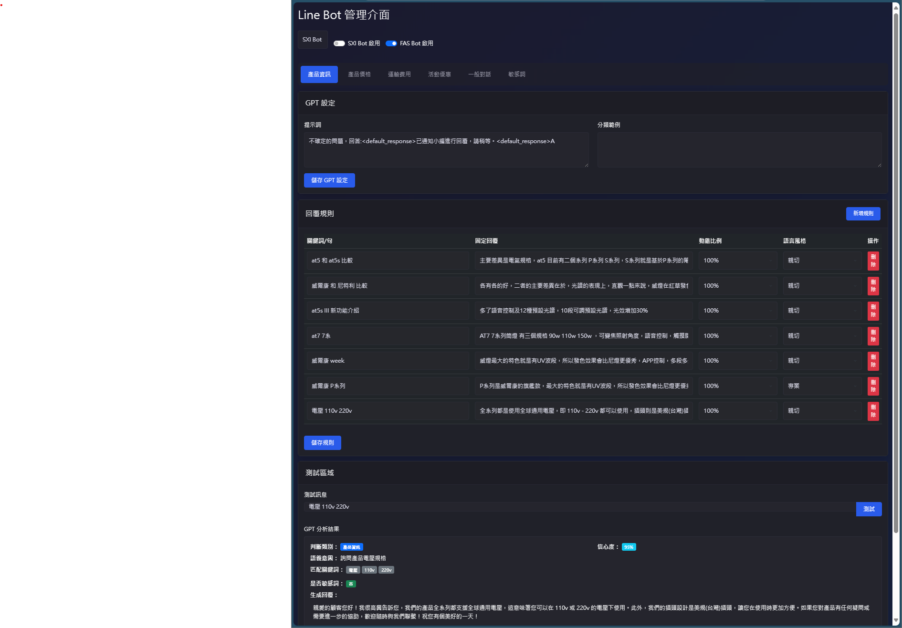

# LINE Bot 專案

## 說明

主要服務於 Line 官方帳號的AI客服系統。
使用 ChatGPT 來與客戶交談，並根據客戶的需求提供相應的回覆。
可以自定義行業的一些條件，讓 ChatGPT 更加精準地回答客戶的問題。
也可以硬性規定回覆的內容，必須按照行業標準回答客戶的問題。
- 例如 法規規定的回答內容，而非 ChatGPT 資料庫中的內容，懂得都懂。
可以透過動態生成比例及語言風格來控制內容的變化，使罐頭訊息看起來更加自然和有趣。
注意：因為採用一次將所有類別的 提示詞、分類範例、回覆規則 中的內容一次性的發給 ChatGPT 進行處理，使用的 token 數量較多，請特別注意控制資料量。

## 概述
基於 Node.js 的 LINE Bot 應用程式，支援雙 webhook（sxi-bot 和 fas-bot），使用 Docker 運行並通過 Nginx 代理管理器進行 SSL 終止。
測試區塊：對話管理功能，包括對話記錄查詢、對話內容分析等。

## 功能特點
- 支援雙 LINE Bot 與獨立 webhook
  - `/webhook1`: sxi-bot
  - `/webhook2`: fas-bot
- 通過 Let's Encrypt 實現 SSL/TLS 加密
- Docker 容器化部署
- Nginx 反向代理
- 健康檢查監控
- 管理介面
  - 規則管理與即時預覽
  - 配置自動保存
  - 友善的使用者提示
- 對話管理功能
  - 對話記錄查詢
  - 對話內容分析

## 前置需求
- Docker 和 Docker Compose
- Node.js
- Nginx 代理管理器
- LINE 開發者帳號
- 已配置 DNS 的網域名稱

## 配置說明
- 為你的網域配置 Nginx 代理管理器
- 通過 Let's Encrypt 設置 SSL 憑證
- 在 LINE 開發者控制台配置 webhook 網址：
  - 主要： `https://[你的網域]/webhook1`
  - 次要： `https://[你的網域]/webhook2`

## 技術文檔
詳細的技術文檔，包括：
- 專案結構
- API 端點說明
- 環境變數配置
- 系統架構說明
- 開發指南
請參考 [DEVELOPMENT.md](DEVELOPMENT.md)

## 系統運作機制

### 訊息處理流程
用戶發送訊息(LINE API) -> Bot接收 -> GPT意圖及語意判斷 -> Bot處理 -> LINE API回覆

### 各版塊要素說明

#### BOT 切換
- 切換至 sxi-bot 或 fas-bot
- 開關控制

#### 類別設定
- 分類名稱：產品資訊、產品價格、運送費用、活動優惠、一般對話、敏感詞

#### 提示詞
- 定義無法回答時的預設回應
- 設定各類別的處理邊界
- 敏感詞的判斷標準

#### 分類範例
- 採用QA形式的參考案例
- 協助GPT理解各類別的範圍
- 提供特殊情況的處理指引

#### 回覆規則
- 設定關鍵字和回覆內容

#### 測試區塊
- 測試對話記錄查詢
- 測試對話內容分析

### 回覆規則重點

#### 關鍵字設定
- GPT會進行語意分析，處理同義詞
- 支援關鍵字的變形識別
- 判斷用戶真正的意圖

#### 動態生成比例
- 0%：完全依照固定回覆
- 50%：混合固定與生成內容
- 100%：僅保留核心訊息重新生成

#### 語言風格（僅用於動態生成）
- 專業：正式商務風格
- 親切：溫和友善風格
- 少女：活潑可愛風格
- 幽默：輕鬆詼諧風格

### GPT意圖及語意判斷

#### 輸入資料
- 用戶訊息
- 所有類別的GPT設定(包含提示詞和分類範例)
- 所有類別的回覆規則(包含關鍵字和回覆內容)

#### 判斷結果
GPT回覆(JSON格式):
- 最適合的類別(例如：產品、價格、運送等)
- 語義意圖分析
- 判斷信心度
- 關鍵詞判斷結果(處理同義詞或變形詞，如"at5"和"at5s")
- 生成內容(如果需要重新生成)

#### 處理流程
1. **敏感詞檢查**
   - 優先判斷是否為敏感詞
   - 如果是敏感詞，直接忽略訊息不回覆

2. **類別處理**
   - 有明確類別且關鍵詞匹配：
     - 根據動態比例決定回覆方式
     - 動態生成時使用設定的語言風格
   - 無法明確判斷或無關鍵詞匹配：
     - 歸類為一般對話
     - 如無法回答，使用預設回覆

## 部署說明
1. 確保所有環境變數正確配置
2. 使用 Docker Compose 進行部署
3. 配置 Nginx 代理和 SSL
4. 驗證 webhook 連接

## 貢獻指南
1. Fork 專案
2. 建立特性分支
3. 提交變更
4. 發起合併請求
